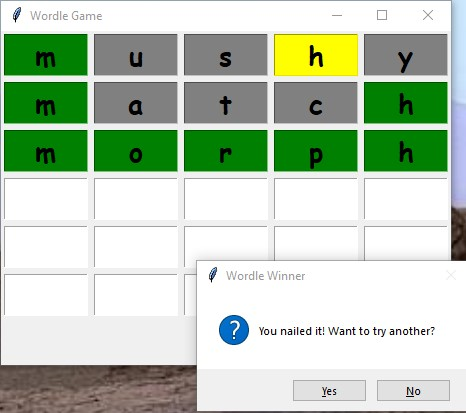

# Wordle Game

It's really a simple version of the game. It selects one of the 2815 words at random. You try to guess/deduce what it is. Just enter a letter in the next square and tabs to the next, until the end of a row. The program then checks your guess. I changes the background color of each square to:

Green, if the letter in part of the word, in the right position.  
Yellow, if it is part of the word, but not in the right position.  
Gray, it it is not in the word at all.

If you want to wimp out and try a different word, click on the **I give up** button.

If you want to play, feel free to just download or clone this repository and play.

Also there is a little bit of data analysis of the word (I may do more later), and the allwords.ipynb notebook is where I scraped the word list from a website. 
